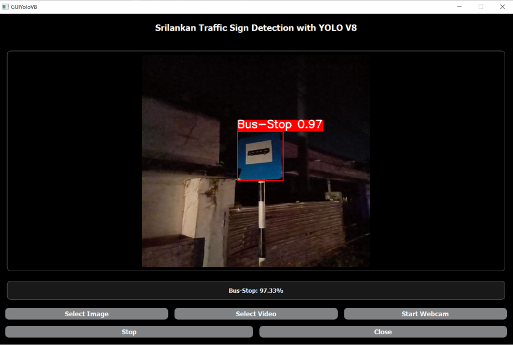
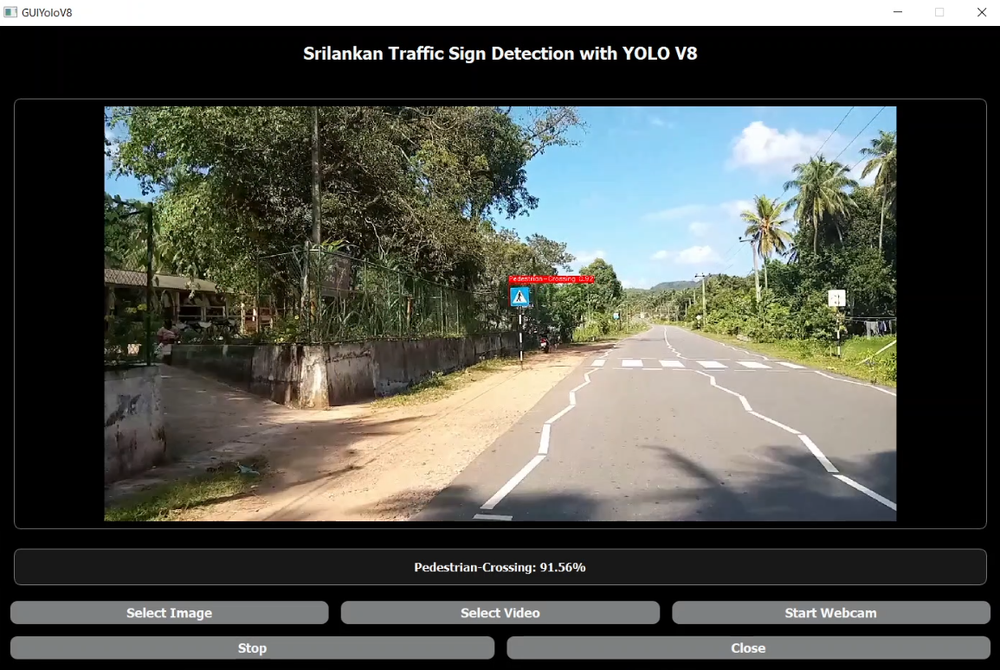
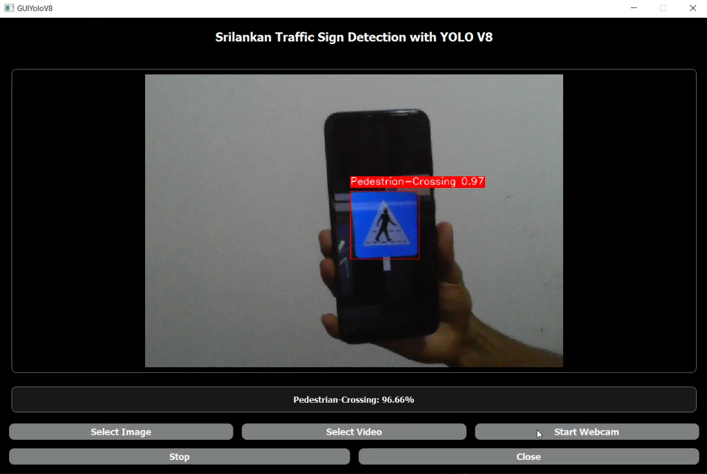

# Sri-Lankan-Traffic-Sign-Detection-with-YOLOv8
A comprehensive repository for a sophisticated Traffic Sign Detection and Recognition (TSDR) system, featuring a real-time graphical user interface (GUI), srilankan traffic sign dataset link, and trained models for improved road safety and traffic management. Explore the code, datasets, and resources to understand and replicate research findings.

## Training Process

To train the Traffic Sign Detection and Recognition (TSDR) system, we employed the YOLOv8 deep learning algorithm. The training process involved the following steps:

1. **Dataset Preparation:** We gathered a diverse dataset of srlankan traffic signs, covering various shapes, colors, and orientations. You can access our dataset by following [this link](https://universe.roboflow.com/traffic-sign-detection-tnjnh/sltsd).

2. **Training Environment:** We conducted the training process on Google Colab, leveraging its powerful GPU capabilities. You can access the Colab notebook with the training process by clicking [here](https://colab.research.google.com/drive/1eX3cOTGTQibGNcrtJcjXKK-QBzNEdL76?usp=drive_link).

3. **Training Configuration:** The YOLOv8 model was configured to optimize accuracy and real-time processing. We fine-tuned the model to ensure it can handle a wide range of real-world scenarios, including challenges like varying brightness, weather conditions, and long distances.

4. **Evaluation and Validation:** The model's performance was rigorously evaluated using a validation dataset to measure accuracy, precision, recall, and various other metrics.

## Results: Input Options

The TSDR system provides users with three main input options through a user-friendly graphical user interface (GUI):

1. **Select Image:** Users can choose to select a single image as input for traffic sign detection. The system will process the selected image and display the detected traffic signs.

2. **Select Video:** Users have the option to select a video file as input. The system will analyze the video frame by frame, identifying traffic signs in real-time.

3. **Start Webcam:** For real-time applications, users can start their webcam and use the TSDR system to detect and recognize traffic signs as they appear on the road.

The GUI's user-centric design ensures that users can easily interact with the system. It provides visual representations of the detected traffic signs and supports user comprehension through audio cues.
